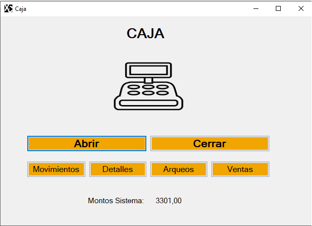
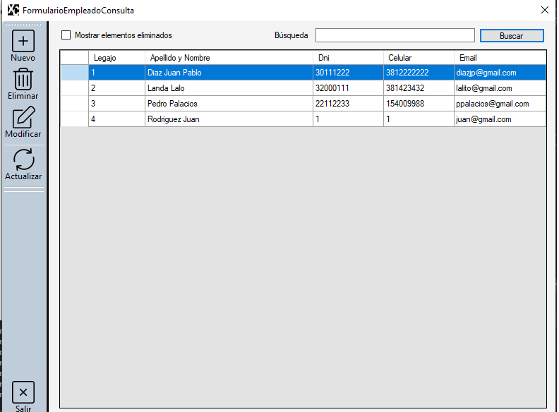
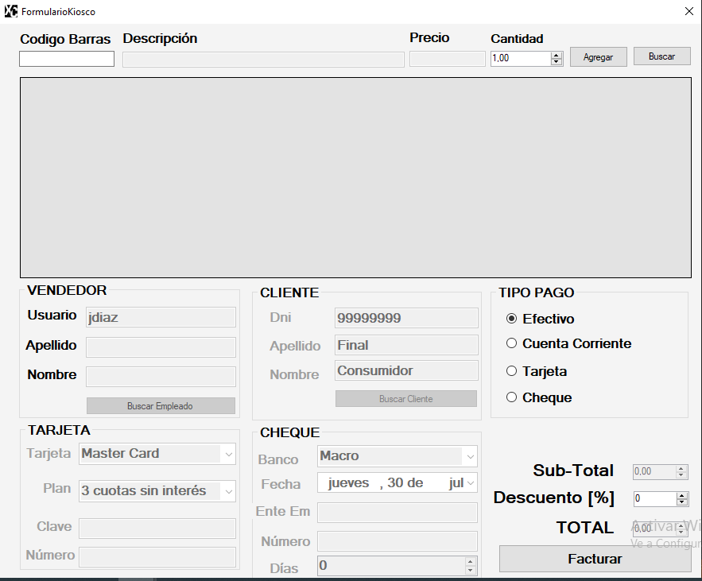
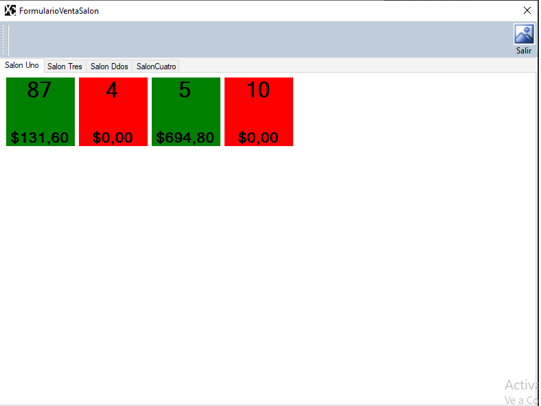
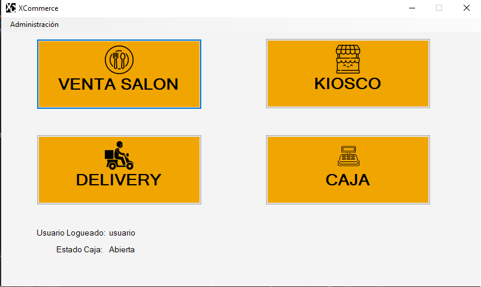
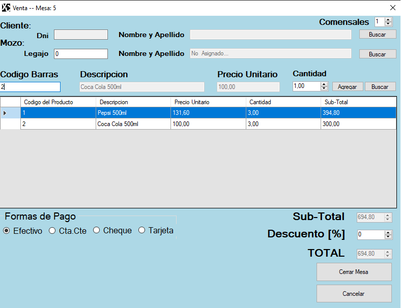

# XCommerce

A Window Forms app made in C# with Entity Framework ORM, model first. It was tested on MSSQL but it's suited to run on differents DBs.

It has inventory and stock managment capabilities. Bar/restaurant, delivery and market selling. Employee registration and login. Cash register, selling and money movements history. Also has check in viewing and priting funtcions.  

-------------------

Aplicación de escritorio hecha en Windows Forms con C# y el ORM Entity Framework, model first. Testeada en MSSQL pero con la posibilidad de usar con otro tipo de DB.

Permite manejar inventario y llevar registro de stock de productos, posee modulos de bar/restaurante, kiosco y delivery. Permite registar empleados y a estos logearse. Caja registradora, historial de ventas y movimientos. Puede imprimir y mostrar facturas.

# Screenshots

# Authors
[@JISayago]( https://github.com/JISayago ) 
[@MartinMiguelRR]( https://github.com/MartinMiguelRR ) 
[@jnrdrgz]( https://github.com/jnrdrgz )
